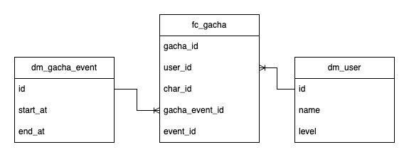
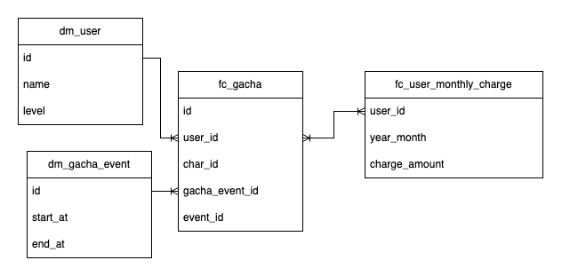

# 目次

- [はじめに](./dev.md)
- ディメンショナルモデリングについて
- [BigQuery x ディメンショナルモデリング](./dev_bigquery.md)
- [BigQuery x dbt x ディメンショナルモデリング](./dev_dbt.md)
- [実際に使ってみる](./dev_query.md)
- [Tips: dbt 開発を快適にする](./dev_dbt_tips.md)
- [Next Step](./dev_next_step.md)

# ディメンショナルモデリングについて

ディメンショナルモデリングとは、

- 調べたい数字を持ったファクトテーブル
- ファクトテーブルの各要素について説明を行うためのディメンションテーブル

の２種類のテーブルにデータを正規化、これら組み合わせることでデータ分析を行う手法です

例えば、ソーシャルゲームの分析をするとして

>「ガチャについて、特定のガチャイベントのユーザごとのガチャのプレイ回数を調べたい」

みたいな要件をディメンショナルモデリングで考えると以下のようなディメンションとファクトを考えることができます。

- ファクト: ガチャ
- ディメンション: ガチャイベント
- ディメンション: ユーザ

SQL に慣れた方は以下のように考えるとわかりやすいかもしれません。

```sql
-- fc_gacha はガチャ結果のファクトテーブル
-- dm_gacha_event はガチャイベントのテーブル
-- dm_user はユーザのテーブル

SELECT 
  dm_user.id, count(distinct fc_gacha.id) as gacha_play_count
FROM 
  fc_gacha
JOIN
  dm_gacha_event ON fc_gacha.dm_gacha_event.gacha_event_id = dm_gacha_event.id
JOIN 
  dm_user ON fc_gacha.user_id = dm_user.id
WHERE
  dm_gacha_event.id = "2023_04_roki_birthday_gacha"
GROUP BY
  dm_user.id
```



またファクト同士の結合を用いて分析を行うこともでき、例えば

>「ガチャについて、課金層を絞って特定のガチャイベントのガチャのプレイ回数を調べたい」

みたいな要件であれば以下のように考えることができます

- ファクト: ガチャ
- ファクト: ユーザの月間課金量
- ディメンション: ガチャイベント
- ディメンション: ユーザ

```sql
-- fc_gacha はガチャ結果のファクトテーブル
-- fc_user_monthly_charge はユーザ課金額のファクトテーブル
-- dm_gacha_event はガチャイベントのテーブル
-- dm_user はユーザのテーブル

SELECT
  dm_user.id, count(distinct fc_gacha.id) as gacha_play_count
FROM
  fc_gacha
JOIN 
  fc_user_monthly_charge ON fc_user_monthly_charge.user_id = fc_gacha.user_id
JOIN
  dm_gacha_event ON fc_gacha.dm_gacha_event.gacha_event_id = dm_gacha_event.id
JOIN 
  dm_user ON fc_gacha.user_id = dm_user.id
WHERE
  dm_gacha_event.id = "2023_04_roki_birthday_gacha" AND
  fc_user_monthly_charge.year_month = "202304" AND 
  fc_user_monthly_charge.charge_amount > 0 AND 
  fc_user_monthly_charge.charge_amount < 10000
GROUP BY
  dm_user.id
```




## ディメンショナルモデリングのメリットとデメリット
ディメンショナルモデリングのメリットとしては、データ絞り込みなどが見やすくなり、また正規化された中間テーブルをベースに分析を進めることで実装者ごとの分析結果のぶれを軽減できることが挙げられます

一方でディメンショナルモデリングのしんどいところとしては、ありとあらゆるデータを繋ぎこんで、全ての因果を解き明かしたい (**ほとんどは相関にすぎません**) 場合などに、テーブルの結合数が素晴らしいことになったり、適切なクエリ設計ができずに激重 Tableau / Looker が爆誕して非難轟轟になったり、というものが挙げられます。

また別のしんどいところとしては、ディメンショナルモデリングではファクトに対してディメンションが原則として one to one / many to one の関係であることが求められる、というものが挙げられます。

例えば、EC サイトの商品をファクトとした `fc_shop_item` を考えます。この時商品に複数タグがつけられるとしてそれを `dm_shop_item_tag` とすると、 `fc_shop_item` と `dm_shop_item_tag` は原則として結びつけるのが困難です。解決方法の例としては以下のような方針が考えられます。

1. 商品IDとタグで一意となるようなファクトテーブル `fc_shop_item_with_tag` を作って `dm_shop_item_tag` を one to one で結びつける
2. `fc_shop_item` に対してブリッジテーブル `bg_shop_item_tag_group` を作り `fc_shop_item` と `bg_shop_item_tag_group` を many to one に結んで `bg_shop_item_tag_group` と `dm_shop_item_tag` を one to many で結びつける
3. (タグの中身ではなくタグ数だけを考えたいのであれば) `dm_shop_item_tag_summary` のような商品IDに対して one to one になるようなディメンションを作り、 one to one で結びつける

参考

- ブリッジテーブルについて : https://bigbear.ai/blog/bridge-tables-deep-dive/
